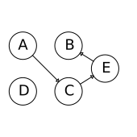
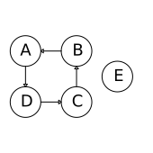
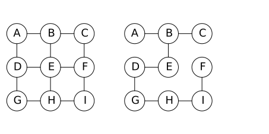
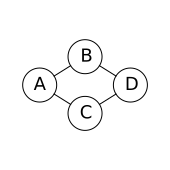

# 图论
# Graphs

**图**由通过**边**（弧）连接的**顶点**（节点）组成。

A __graph__ consists of __vertices__ (nodes) connected by __edges__ (arcs).

图的两个主要类型是边不具有任何特定方向的无向图,和边具有方向的有向图，例如，可以存在由节点A指向节点B的边，但是没有B指向A的边.

The two main categories of graphs are __undirected__ graphs, in which edges don't have any particular direction, and __directed graphs__, where edges have direction - for example, there may be an edge from node A to node B, but no edge from node B to node A.

一般来说，我们对图形使用以下符号$G$：$n$是顶点的数量，即$|V|$，$m$是边的数量，即$|E|$.

Generally, we use the following notation for a graph $G$: $n$ is the number of vertices, i.e. $|V|$, $m$ is the number of edges, i.e. $|E|$.

无向图中还细分出几种类型：

Within undirected graphs there are other distinctions:

- **简单图**中没有循环并且仅允许存在单个边
- **正则图**是每个顶点具有相同数量的邻点(即相同的度)
- **完全图**中，每对顶点都有一条边连接
- **连接图**是其中在每对顶点之间存在一条路径

- a _simple_ graph is a graph in which there are no loops and only single edges are allowed
- a _regular_ graph is one in which each vertex has the same number of neighbors (i.e. the same degree)
- a _complete_ graph is a simple graph where every pair of vertices is connected by an edge
- a _connected_ graph is a graph where there exists a path between every pair of vertices

对于没有平行边的连接图（即每对顶点之间只有零或一条边），$m$在$\Omega(n)$和$O(n^2)$之间。

For a connected graph with no parallel edges (i.e. each pair of vertices has only zero or one edge between it), $m$ is somewhere between $\Omega(n)$ and $O(n^2)$.

通常，如果$m$等于或接近$O(n)$（即图有更少的边数），则被称为稀疏的。如果$m$更接近$O(n^2)$，通常被称为稠密的。

Generally, a graph is said to be __sparse__ if $m$ is $O(n)$ or close to it (that is, it has the lower end of number of edges). If $m$ is closer to $O(n^2)$, this is generally said to be a __dense__ graph.

??TODO: $\Theta(n+3m) = \Theta(m+n)$ 是为何
邻接矩阵需要$\Theta(N^2)$的空间,如果图是稀疏的,就会对空间造成浪费,这种情况用邻接列表会更合适 —— 用一个顶点数组和一个边数组,每条边指向其端点,每个端点指向其上的边。这需要$\Theta(m+n)$的空间(因为顶点的数组需要$\Theta(n)$空间,边数组,边-点数组,点-边数组分别都占$\Theta(m)$ ,因为$\Theta(n+3m) = \Theta(m+n)$) ,所以它对稀疏图更适合。

An adjacency matrix requires $\Theta(n^2)$ space. If the graph is sparse, this is a waste of space, and an adjacency list is more appropriate - you have an array of vertices and an array of edges. Each edge points to its endpoints, and each vertex points to edges incident on it. This requires $\Theta(m+n)$ space (because the array of vertices takes $\Theta(n)$ space and the arrays of edges, edge-to-endpoints, and vertex-to-edges each take $\Theta(m)$, for $\Theta(n+3m) = \Theta(m+n)$), so it is better for sparse graphs.

看一下这个例子:

Consider the accompanying example graph.

从$A \to B$的**路径**是指由$A \to B$的节点序列, 包含$A$和$B$.

A __path__ $A \to B$ is the sequence of nodes connecting $A$ to $B$, including $A$ and $B$.

在这里$A \to B$的路径是$A,C,E,B$.

Here the path $A \to B$ is $A,C,E,B$.

$A,C,E$是$B$的祖先.
$C,E,B$是$A$的后代.

$A,C,E$ are the __ancestors__ of $B$.
$C,E,B$ are the __descendants__ of $A$.

一个**循环**(cycle)是一个起点与终点相同的有向路径,这里$A,D,C,B$形成一个循环，

A __cycle__ is a directed path which ends where it starts. Here, $A,D,C,B$ form a cycle.

一个**环**是任何结束于起点的路径(无论是否有向).

A __loop__ is any path (directed or not) which ends where it starts.

一个图内没有循环, 则被称作是**无环的**.

A graph with no cycles is said to be __acyclic__.

一个**弦**是在一个循环中连接两个不相邻的节点的边。

A __chord__ is any edge which connects two non-adjacent nodes in a loop.

**有向无环图**（DAG）会经常使用。在DAG中，指向某节点的是这个节点的**父节点**, 被指向的节点是**子节点**。一个**族**是某节点及其父母。

__Directed acyclic graphs__ (DAGs) are used often. In a DAG, __parents__ are the nodes which point to a given node; the nodes that a given node points to are its __children__. A __family__ of a node is the node and its parents.

**Markov blanket**是一个节点的父子节点, 以及它子节点的所有父节点(包含它自身).

The __Markov blanket__ of a node is its parents, children, and the parents of its children (including itself).

在一个无向图中, 一个节点的**邻点**是指直接与它有连接的节点.

For an undirected graph, a node's __neighbors__ are noes directly connected to it.

在无向图中,**团**是一个全连接子集,团中所有成员都互为邻节点.

In an undirected graph, a __clique__ is a fully-connected subset of nodes. All members of a clique are neighbors.

**最大团**是指不为其他团的子集的团.

A __maximal clique__ is a clique which is not a subset of another clique.

在这图中:

In this graph:

- $\{A,B,C,D\}$ 是一个最大团
- $\{B,C,E\}$ 是一个最大团 
- $\{A,B,C\}$ 不是一个最大团, 被包含在$\{A,B,C,D\}$中

- $\{A,B,C,D\}$ is a maximal clique
- $\{B,C,E\}$ is a maximal clique
- $\{A,B,C\}$ is a non-maximal clique, contained in $\{A,B,C,D\}$

An undirected graph is __connected__ if there is a path between every pair of nodes. That is, there is no isolated subgraph.

For a non-connected graph, its __connected components__ are its subgraphs which are connected.

A __singly connected graph__ is the connected graph (directed or not) where there is only one path between each pair of nodes. This is equivalent to a __tree__.

A non-singly connected graph is said to be __multiply connected__.

A __spanning tree__ of an undirected graph is one where the sum of all edge weights is at least as large as any other spanning trees'.

Graphs can be represented as an __adjacency matrix__:

$$
A =
\begin{bmatrix}
0 & 1 & 1 & 0 \\
1 & 0 & 1 & 1 \\
1 & 1 & 0 & 1 \\
0 & 1 & 1 & 0
\end{bmatrix}
$$

Where a non-zero value at $A_{ij}$ indicates that node $i$ is connected to node $j$.

A __clique matrix__ represents the maximal cliques in a graph.

For example, this clique matrix describes the following maximal clique:

$$
C =
\begin{bmatrix}
1 & 0 \\
1 & 1 \\
1 & 1 \\
0 & 1
\end{bmatrix}
$$

A clique matrix containing only 2-node cliques is an __incidence matrix__:

$$
C =
\begin{bmatrix}
1 & 1 & 0 & 0 & 0 \\
1 & 0 & 1 & 1 & 0 \\
0 & 1 & 1 & 0 & 1 \\
0 & 0 & 0 & 1 & 1
\end{bmatrix}
$$

## References

- [Algorithms: Design and Analysis, Part 1](https://www.coursera.org/course/algo). Tim Roughgarden. Stanford/Coursera.
- _Bayesian Reasoning and Machine Learning_. David Barber.
- [Probabilistic Graphical Models](https://www.coursera.org/course/pgm). Daphne Koller. Stanford University/Coursera.
- https://www.wikiwand.com/en/Markov_blanket
